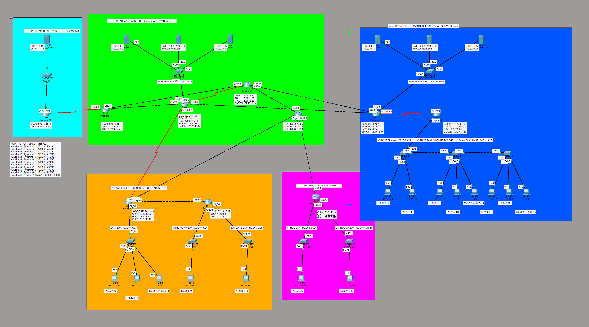
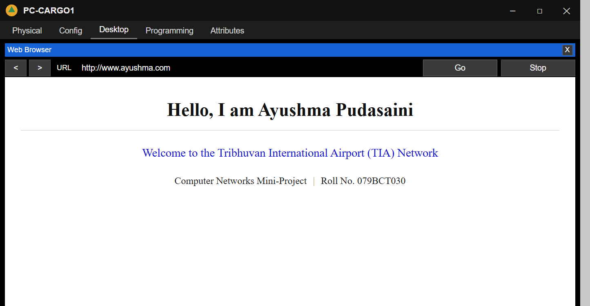

Computer Networks Mini-Project - Pulchowk Campus - TIA Airport Network Design in Cisco Packet Tracer

A complete enterprise network for **Tribhuvan International Airport (TIA), Kathmandu**, designed and realised in **Cisco Packet Tracer** as a Computer Networks mini-project.

**Author:** Ayushma Pudasaini · Roll No. **079BCT030** · BCT, IOE Pulchowk Campus

---

## Overview

An airport is a single site that must serve very different groups of users at the same time — thousands of passengers who only need Wi-Fi, immigration officers handling sensitive data, hundreds of CCTV cameras, and baggage-handling controllers that must never be interrupted. This project addresses the whole airport from **one `/20` address block**, divides it with **VLSM** into ten right-sized networks, and routes them with **multi-area OSPF**, connecting to the Internet through an upstream **ISP**.

| | |
|---|---|
| Address pool | `172.20.0.0/20` (4,096 addresses) |
| LAN networks | **10** (seven different sizes, /22 → /28) |
| Routers | **10** (9 internal + 1 ISP; 3 carry no user LAN) |
| OSPF areas | **4** (Area 0 backbone + Areas 1, 2, 3) |
| VLANs | **3** (Check-in, Public Wi-Fi, Airline) over 3 trunked switches |
| Switches / Servers | 11 / 7 (2 DNS + 2 Web + 2 DHCP + 1 ISP DNS) |
| Redundant areas | 2 (Terminal and Security are dual-homed) |

---

## Network Architecture

The design follows a three-level **core–distribution–access** hierarchy:

- **Upstream ISP** — provider network with the top-level DNS, reached over a serial leased line.
- **Area 0 — Backbone** — the transit spine (edge + core routers) and Server Farm A.
- **Area 1 — Terminal** — the passenger building with three VLANs and Server Farm B.
- **Area 2 — Security & Operations** — CCTV, Immigration and Baggage.
- **Area 3 — Cargo & Admin** — cargo terminal and CAAN administration.

## Architecture



*Colour-coded by OSPF area. Every network, VLAN, interface IP and server service is labelled on the canvas.*

---

## Subnetting Details

The `172.20.0.0/20` pool is divided with VLSM in descending order of size (seven different prefix lengths):

| Zone (VLAN) | Network ID | Mask | Usable Range | Hosts | Router |
|---|---|---|---|---|---|
| Public Wi-Fi (VLAN 20) | 172.20.0.0/22 | 255.255.252.0 | .0.1 – .3.254 | 1022 | Ayushma6 |
| CCTV & Surveillance | 172.20.4.0/23 | 255.255.254.0 | .4.1 – .5.254 | 510 | Ayushma7 |
| Check-in & Gates (VLAN 10) | 172.20.6.0/24 | 255.255.255.0 | .6.1 – .6.254 | 254 | Ayushma6 |
| Baggage Handling | 172.20.7.0/25 | 255.255.255.128 | .7.1 – .7.126 | 126 | Ayushma8 |
| Airline Offices (VLAN 30) | 172.20.7.128/25 | 255.255.255.128 | .7.129 – .7.254 | 126 | Ayushma6 |
| Customs & Immigration | 172.20.8.0/26 | 255.255.255.192 | .8.1 – .8.62 | 62 | Ayushma8 |
| Cargo Terminal | 172.20.8.64/26 | 255.255.255.192 | .8.65 – .8.126 | 62 | Ayushma9 |
| CAAN Administration | 172.20.8.128/27 | 255.255.255.224 | .8.129 – .8.158 | 30 | Ayushma9 |
| Server Farm A | 172.20.14.0/28 | 255.255.255.240 | .14.1 – .14.14 | 14 | Ayushma2 |
| Server Farm B | 172.20.14.16/28 | 255.255.255.240 | .14.17 – .14.30 | 14 | Ayushma5 |

The eleven router-to-router links each use a `/30` from `172.20.15.0/24`; the WAN link uses `203.0.113.0/30` and the ISP LAN `203.0.113.8/29`.

---

## Router Naming and Roles

Every internal router is named with the author's first name and an index (submission requirement).

| Router | Role | OSPF Area |
|---|---|---|
| Ayushma1 | Edge — WAN uplink, default route, **no user LAN** | 0 |
| Ayushma2 | Core — hosts Server Farm A | 0 |
| Ayushma3 | Core — transit, **no user LAN** | 0 |
| Ayushma4 | Backbone transit, **no user LAN** | 0 |
| Ayushma5 | Terminal ABR — hosts Server Farm B | 0 & 1 |
| Ayushma6 | Inter-VLAN routing (VLAN 10/20/30) | 1 |
| Ayushma7 | Security ABR — CCTV | 0 & 2 |
| Ayushma8 | Immigration and Baggage | 2 |
| Ayushma9 | Cargo ABR — Cargo and Admin | 0 & 3 |
| Ayushma10 | ISP — top-level DNS, single static return route | — |

---

## Key Features

- **VLSM subnetting** — ten networks of seven different sizes from one `/20` pool.
- **Multi-area OSPF** — four areas with three Area Border Routers; manual router-IDs.
- **VLANs + 802.1Q trunking** — three terminal VLANs carried across three switches.
- **Inter-VLAN routing** — router-on-a-stick on Ayushma6 (dot1Q subinterfaces).
- **Router-based DHCP** — one pool per LAN supplying IP, gateway and DNS.
- **DNS & Web** — two internal DNS servers (identical records) + a provider DNS; two web servers (`www.ayushma.com`, `www.pudasaini.com`) on different subnets.
- **ISP connectivity** — a default route towards the ISP; the ISP returns traffic with **one static route** and no dynamic routing.
- **Redundancy** — the Terminal and Security areas each reach the core over two paths.
- **Remote access** — every router and switch is telnet-enabled.

---

## Configuration Highlights

**OSPF routing**
```
router ospf 1
 router-id 1.1.1.1
 network 172.20.15.0 0.0.0.3 area 0
 default-information originate
```

**Internet forwarding (edge) and return path (ISP)**
```
! Ayushma1 (edge)
ip route 0.0.0.0 0.0.0.0 203.0.113.1
! Ayushma10 (ISP) — single static route, minimum entries
ip route 172.20.0.0 255.255.240.0 203.0.113.2
```

**Inter-VLAN routing (router-on-a-stick)**
```
interface GigabitEthernet0/0.20
 encapsulation dot1Q 20
 ip address 172.20.0.1 255.255.252.0
```

**Remote access / security credentials**
```
enable secret class
line con 0
 password cisco
 login
line vty 0 4
 password network
 login
 transport input telnet
```
Passwords: console `cisco` · privileged `class` · telnet `network`.

> The full command set for every device is in [`Configuration-Commands.md`](Configuration-Commands.md).

---

## Verification

- Every internal network is reachable from any computer (ping tested from PCs in different areas).
- Traffic to external addresses is forwarded to the ISP via the default route.
- DHCP hands out address, gateway and DNS on every LAN.
- Shutting a primary link causes OSPF to re-route through the backup automatically.
- Topology health check: no down links, no duplicate IP addresses.

---

## Services in Action

**Web server reached by name across the network.** A PC in the Cargo area opens `http://www.ayushma.com`; DNS resolves the name to the web server in Server Farm A and the hosted page loads — confirming that DNS resolution, inter-area routing and the web service all work end to end.



---

## Files in this repository

| File | Description |
|---|---|
| `TIA_Network_Design.pkt` | Cisco Packet Tracer simulation file |
| `Report.pdf` | Mini-project report |
| `Configuration-Commands.md` | Full IOS configuration commands for every device |
| `images/` | Topology screenshots |

**To open:** download `TIA_Network_Design.pkt` and open it in Cisco Packet Tracer (8.x or newer).

---

## Conclusion

The network was designed and realised successfully in Packet Tracer. The `172.20.0.0/20` block was divided by VLSM into ten LANs of seven prefix sizes with no overlap, ten routers were deployed with three carrying no user LAN, and OSPF was brought up across four areas. Internet access uses a default route to the provider while the provider returns traffic with a single static route. DHCP, DNS and web services are operable, every router and switch is reachable by telnet, and the topology is fully labelled and colour-coded — meeting every requirement of the assignment, with room to grow.
